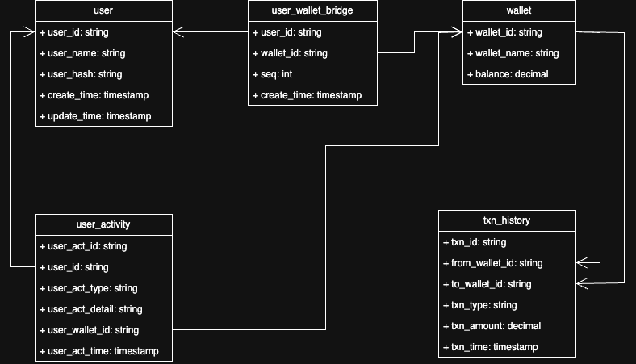

# Wallet App Server
A simple and clean wallet app backend server 

## User Requirements
According to the user requirement, the following functions are covered:
- User can deposit money into his/her wallet
- User can withdraw money from his/her wallet
- User can send money to another user
- User can check his/her wallet balance
- User can view his/her transaction history

In addition, I think it makes sense that only the authenticated user can be able to access our app, so this implementation will also cover an API endpoint for user to login and get authenticated.

## Project Design

### General Design
The system are mainly consists of three small modules: user, wallet and transaction. 
- user module is responsible for user login, user information maintenance and user activity tracking
- wallet module is responsible for wallet information maintenance, wallet balance checking, deposit/withdraw
- transaction module is responsible for transfer, transaction history query

According to this design, I'll split the system API controllers, services and repositories into separate .go files.

### UML

### API endpoints

### Auth APIs

### Login
POST /api/v1/auth/login

## Wallet APIs

### List Wallets
GET /api/v1/wallet/list

### Deposit
POST /api/v1/wallet/deposit

### Withdraw
POST /api/v1/wallet/withdraw

### Check Balance
GET /api/v1/wallet/checkBalance

## Transaction APIs

### Transfer
POST /api/v1/transaction/transfer

### Check Transaction History
POST /api/v1/transaction/history

# Installation

# Usage

## Configuration

## Start API Server

# Testing